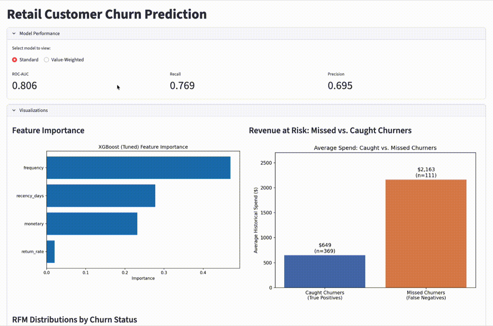

# Retail Customer Churn Prediction

Predicting customer churn for a UK-based online gift retailer using real, messy transaction data — with a self-engineered churn label (no pre-built target variable), a business-facing evaluation, and an interactive dashboard for exploring results.

## Problem

Customer retention is far cheaper than acquisition, but knowing *who's actually at risk* of leaving is non-trivial when a business has no explicit "churned" flag in its data. This project builds a full pipeline — from raw transactions to a deployable churn model and interactive dashboard — to identify at-risk customers and quantify the revenue tied to them.

## Dataset

[UCI Online Retail II](https://archive.ics.uci.edu/dataset/502/online+retail+ii) (accessed via Kaggle mirror through `kagglehub`): ~1.07M transactions from a UK-based online retailer between Dec 2009 and Dec 2011, covering ~5,900 customers. Deliberately chosen *without* a pre-built churn label, requiring the label itself to be engineered — a closer analog to real-world business problems than most tutorial datasets.

## Approach

1. **EDA**: missing values, cancellation patterns, date range, customer distribution
2. **Cleaning**: dropped ~243K rows missing `Customer ID`; split cancelled orders from purchases to preserve return behavior as a feature rather than discarding it
3. **Churn labeling**: tested 90-day and 180-day windows against a fixed reference date; selected 180 days based on the dataset's observed ~180-day median purchase cycle (90 days over-flagged normal infrequent buyers as "churned")
4. **Feature engineering**: RFM (recency, frequency, monetary) + return rate, computed strictly on pre-reference-date data to avoid leakage
5. **Modeling**: logistic regression baseline, then XGBoost — tuned via grid search (5-fold CV) after untuned XGBoost initially underperformed the baseline
6. **Evaluation**: standard ML metrics (ROC-AUC, precision/recall) plus a business-facing "revenue at risk" metric
7. **Refactor**: pipeline logic moved from notebook into reusable, type-hinted `src/` modules, each independently runnable and testable
8. **Dashboard**: interactive Streamlit app for exploring model performance, key visualizations, and live per-customer churn predictions

## Results

| Metric | Logistic Regression | XGBoost (tuned) | XGBoost (value-weighted) |
|---|---|---|---|
| ROC-AUC | 0.791 | **0.806** | 0.799 |
| Recall (churned) | 0.68 | **0.77** | 0.75 |
| Precision (churned) | 0.70 | 0.69 | 0.70 |
| Revenue captured | — | 49.9% | **57.6%** |

**Final model**: tuned XGBoost (`max_depth=2`, `n_estimators=50`, `learning_rate=0.1`) — a deliberately shallow model, appropriate given the small feature set and dataset size.

**Feature importance**: `frequency` (0.47) was the strongest predictor, ahead of `recency_days` (0.28) and `monetary` (0.23) — despite recency showing the most visually obvious relationship with churn during EDA. `return_rate` contributed minimally (0.02).

**Key finding — revenue at risk**: while the tuned model catches 77% of churners by customer count, it only captures 49.9% of the associated revenue. Missed churners (false negatives) have an average historical spend of **$2,163**, over 3x the $649 average of correctly identified churners — meaning the model systematically underperforms on high-value accounts, likely because large/infrequent wholesale-style purchasing patterns resemble the "about to churn" signal.

**Follow-up experiment — value-weighted training**: to test whether this gap was addressable, XGBoost was retrained using `monetary` value as a sample weight, penalizing misclassification of high-spend customers more heavily. This improved revenue capture to **57.6%** (+7.7 points), at a small cost to overall recall (0.77 → 0.75) and ROC-AUC (0.806 → 0.799). This confirms the gap was partly a training-objective issue, not purely a feature limitation — and highlights that "best model" depends on business priorities: the standard model reaches more customers by count, while the value-weighted model protects more revenue. Model choice should reflect which objective matters more to the business deploying it.

## Dashboard

An interactive Streamlit dashboard lets you explore the project's results without running the notebook:

- **Model Performance**: toggle between the standard and value-weighted models to compare ROC-AUC, recall, and precision
- **Visualizations**: feature importance, RFM distributions by churn status, and the revenue-at-risk comparison
- **Customer Lookup**: select any customer by ID to view their RFM profile and a live churn prediction, alongside their actual historical outcome



## Tech Stack

Python, pandas, scikit-learn, XGBoost, matplotlib, Streamlit, Jupyter

## Project Structure

```
retail-churn-prediction/
├── app/
│   └── dashboard.py       # Streamlit dashboard
├── notebooks/
│   └── 01_eda.ipynb       # Full pipeline: EDA → cleaning → labeling → features → modeling
├── src/
│   └── data_loader.py     # Data fetch + cleaning
│   └── churn_labeling.py  # Reference date, feature/label window split, churn label
│   └── features.py        # RFM + return-rate feature engineering
│   └── model.py           # Train, evaluate, and persist the model (standard or value-weighted)
├── reports/               # Saved visualizations
├── data/                  # Not tracked (raw fetched via kagglehub; processed data gitignored)
├── requirements.txt
└── README.md
```

## Setup

```bash
python3 -m venv venv
source venv/bin/activate
pip install -r requirements.txt
```

Dataset is fetched automatically via `kagglehub` on first run (requires a free Kaggle account and API token).

To train the models (required before running the dashboard):
```bash
python3 -m src.model              # standard model
python3 -m src.model --weighted   # value-weighted model
```

To launch the dashboard:
```bash
streamlit run app/dashboard.py
```